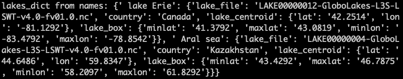
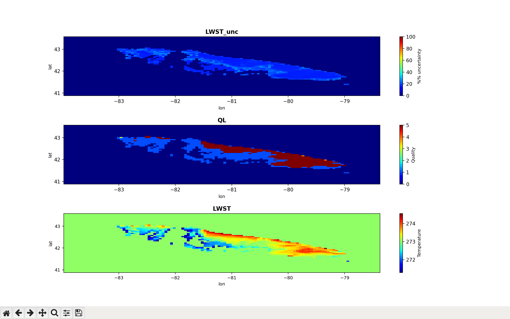

# Flake
A package to explore and nudge a one-dimensional lake model based on FLake (Mironov D.V., 2008)

Flake requires meteorological forcing to compute necessary lw/sw atmospherical fluxes and sensible
heat fluxes. Minimum meteorological inputs are:

i) wind speed at 10 meters,

ii) T_air at 2 meters, 

iii) specific humidity or vapor pressure,

iv) lower-level cloud cover,

v) solar flux (short wave),

vi) downward atmospheric long-wave solar flux.

Output variables are surface temperature, mixed layer depth, mixed layer temperature, bottom
temperature, and others.

This package uses ctypes to "tunnel" from a python main program (flake.py) to the Flake simulator
(fortran files in in SRC)

1) Software Requirements: gfortran, Numpy, netCDF4, python3.6, f90nml, pytz, cdsapi, scipy, matplotlib

Or execute:

    ~/home$ conda env create -f flakeEnv.yaml 
    
    ~/home$ conda activate flakeEnv           # Establishes the full environment (takes a while)

Getting started:

2) Do a fresh make and execute:

       ~/home$ make FIpy   #makes the shared library for use within python scripts

4) From the top-level directory, execute:

       ~/home$ python python/flake.py

   As currently configured, flake.py executes the unit test UT_assemble_inputs_FE() and generates a
   flake example (.i.e _FE) based on meteo data for a specific lake called Mueggelsee near Berlin.

6) Comment/uncomment lines as necessary to perform other unit tests

    i) Use _FE for demonstration. _FE means "flake example" and the unit tests can be 

   ii) if seeking to use UT_assemble_inputs_ERA5(), then ERA5.nc reanalysis must be used. It usually
       lives in METEO/ERA5_NorEur/ERA5.nc, but it is generally a Gb or larger and therefore
       can't be stored in the github repository.
       Use the ERA5 reanalysis located at:
       https://cds.climate.copernicus.eu/cdsapp#!/dataset/reanalysis-era5-single-levels?tab=form
       or, use the API called import_cdsapi.py located at METEO/CEDA_apis/import_cdsapi.py . This
       api allows for geographical slicing of meteorological data. It requires a CEDA login and key.

8) Obs.UT_select_lake() will select lakes based on a geographical boundary, lake names, or global lake ID
   It is useful for preparing a python dict() (structure) that contains meta information pertaining
   to candidate lakes for further analysis. See >>help(select_lake).

   

10) Obs.UT_get_Lake_temp_vs_time() produces the skin temperature or lswt (lake surface water temperature, uncorrected) 
   based on satellite-derived data (http://www.laketemp.net/home/). A few example days are plotted showing
   available unmasked data, quality level, uncertainty level, etc. of satellite data. Data are filtered
   accordingly for subsequent analysis and only a subset of the full lake surface water temperature data
   are suitable for use as an observational constraint of lswt on any given day.

Here is an example of the same lake (GLOBOLAKE ID 0000000012), but showing only the region of interest
with qualifying pixels. All other pixels are masked.

And here are a few years (1995-1997) of satellite-derived lake surface water temperature after filtering

